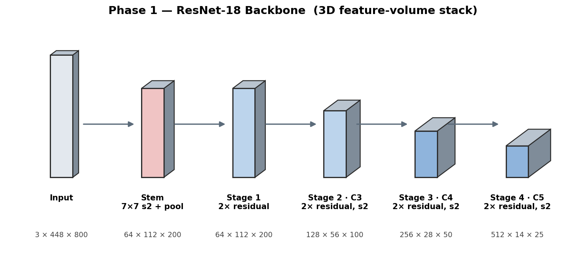
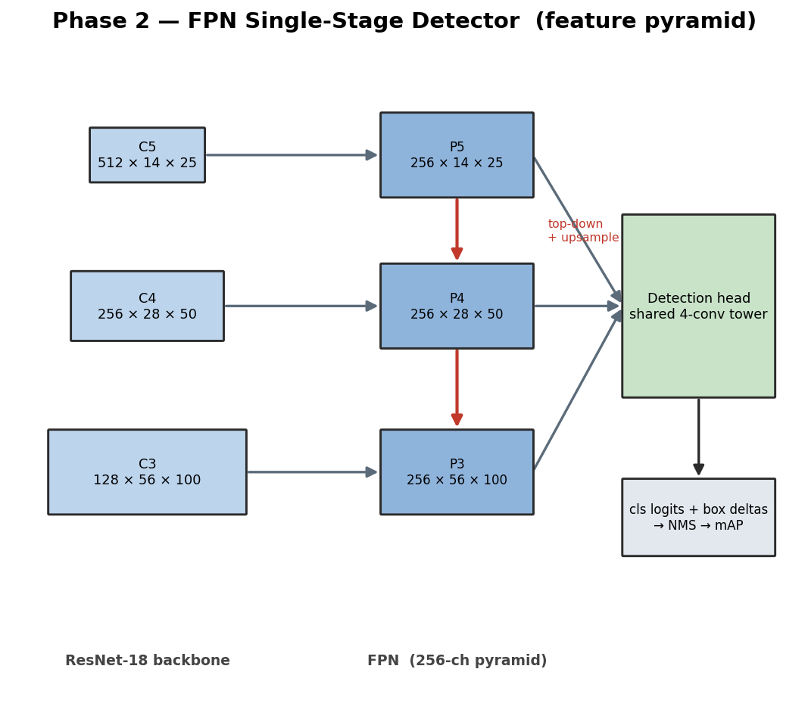
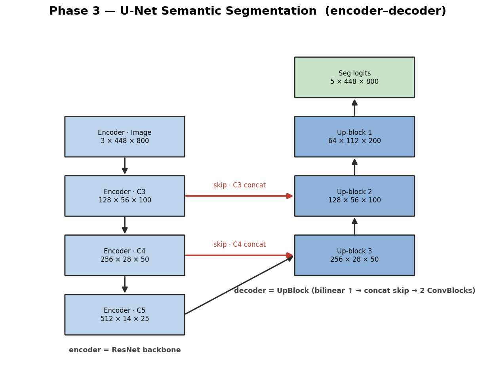
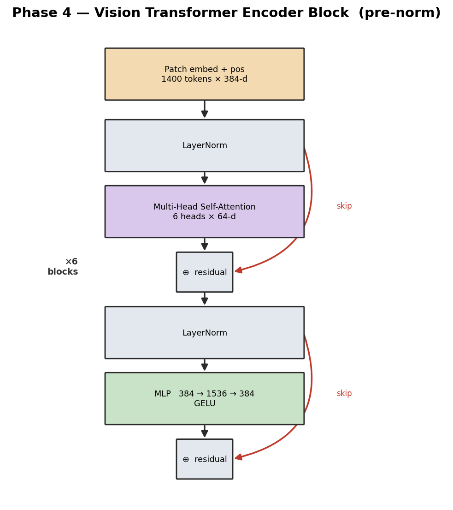
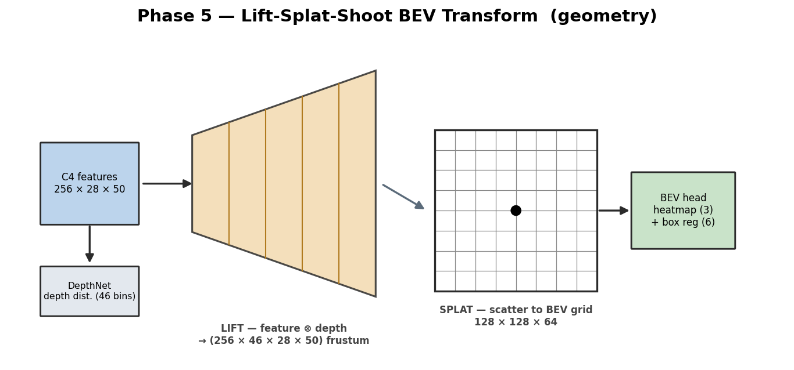
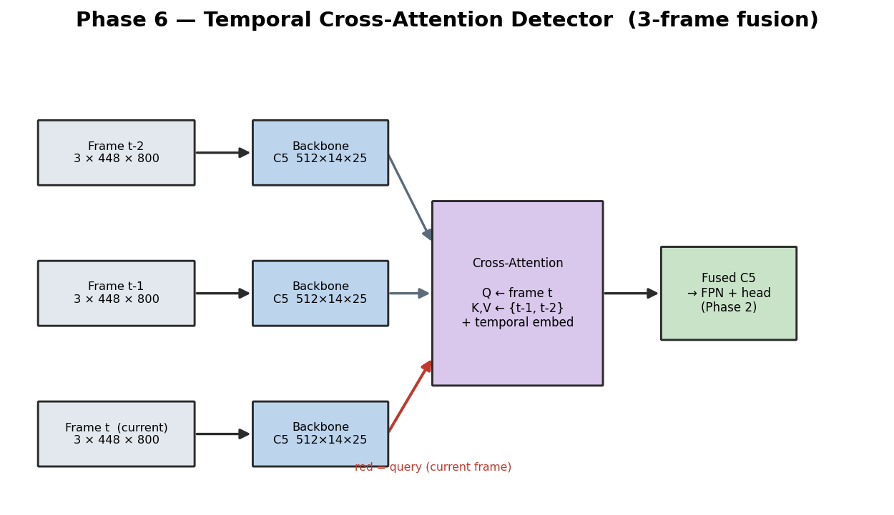
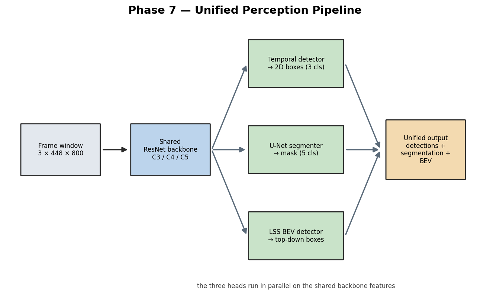

# Architecture Plan — Autonomous Driving Perception Stack

A formal, phase-by-phase architecture reference. Each phase carries a diagram
drawn in a style suited to that network — a 3D feature-volume stack for the
backbone, a feature-pyramid flowchart for the detector, a U-shape for the
segmenter, a pre-norm flowchart for the transformer, a lift-splat geometric
schematic for the BEV stage, a fusion graph for the temporal stage, and a
fan-out pipeline for the integrated system. Every element is annotated with its
tensor shape in **channels × height × width** order.

Diagrams are generated by `tools/draw_architecture.py`
(`python -m tools.draw_architecture` → `docs/diagrams/`).

**Dataset.** nuScenes mini — 10 scenes, ~404 keyframe samples, 6 cameras. The
split is scene-level: 8 scenes for training (~324 samples), 2 for validation
(~80). All images are resized to **3 × 448 × 800** from the native 900 × 1600.

---

## Phase 0 — Data Pipeline

No network. `data/dataset.py` defines `NuScenesDetectionDataset`, which loads a
camera image, projects each 3D ground-truth box into the 2D image plane through
the camera intrinsic matrix, and reduces the 23 nuScenes annotation categories
to three classes — car (0), pedestrian (1), cyclist (2). `data/transforms.py`
provides two albumentations pipelines: a training pipeline (horizontal flip,
shift-scale-rotate, random crop, colour jitter, blur, Gaussian noise, ImageNet
normalization) and a deterministic validation pipeline (resize + normalize).
`data/dataloader.py` is the loader factory. The train/validation split is taken
over whole *scenes* rather than individual frames, because consecutive frames in
a scene are near-duplicates and a per-frame split would leak training data into
validation.

---

## Phase 1 — Convolutional Backbone



**Architecture.** A six-stage ResNet-18-style convolutional network, built from
scratch, that serves as the shared feature extractor for every later phase. It
accepts an RGB image of shape **3 × 448 × 800**. The **stem** applies a 7×7
convolution at stride 2 (64 output channels) followed by 3×3 max-pooling at
stride 2; the two stride-2 operations reduce spatial resolution four-fold,
producing a **64 × 112 × 200** feature map. **Stage 1** applies two residual
blocks at stride 1 — channels and resolution are preserved at
**64 × 112 × 200**. **Stage 2** applies two residual blocks, the first at stride
2, doubling channels and halving each spatial dimension to **128 × 56 × 100**;
this map is exported as **C3** (stride 8). **Stage 3** repeats the pattern,
exporting **C4** at **256 × 28 × 50** (stride 16). **Stage 4** produces **C5** at
**512 × 14 × 25** (stride 32). In the diagram, each volume's front-face height is
proportional to its spatial resolution and its depth into the page is
proportional to its channel count — the network visibly grows thinner-and-deeper
left to right.

**Components.** `models/backbone/resnet.py` — `ConvBlock` (Conv2d → BatchNorm →
ReLU), `ResidualBlock` (two ConvBlocks plus a projection-shortcut skip),
`_make_stage`, `ResNetBackbone`, and `load_pretrained()` (maps 120 torchvision
ResNet-18 ImageNet parameters onto this naming convention).
`models/backbone/linear_classifier.py` and `mlp.py` are the linear-classifier
and MLP baselines that precede the CNN. `training/` holds the `Trainer` (AMP
loop, early stopping) and the optimizer/scheduler builders.

**Design decisions.** The backbone exports three feature maps (C3/C4/C5) rather
than one — the detector's FPN and the U-Net decoder both consume a resolution
pyramid. ImageNet-pretrained weights are loadable because 324 training images
cannot teach useful low-level filters from random initialization.

**Result.** A feature extractor producing C3 (128 × 56 × 100), C4
(256 × 28 × 50), C5 (512 × 14 × 25).

---

## Phase 2 — 2D Object Detection



**Architecture.** A single-stage, RetinaNet-style detector. The diagram's left
column is the backbone, drawn bottom-up by resolution: **C3** (128 × 56 × 100),
**C4** (256 × 28 × 50), **C5** (512 × 14 × 25). The middle column is the
**Feature Pyramid Network**, which converts each backbone map to a uniform
256-channel pyramid level — **P5** (256 × 14 × 25), **P4** (256 × 28 × 50),
**P3** (256 × 56 × 100) — through a lateral 1×1 convolution (the grey arrows)
plus a top-down pathway (the red arrows) that upsamples the coarser level and
adds it in. The shared **detection head** — a four-convolution tower — runs on
every pyramid level and emits, per anchor, a classification vector (3 classes)
and a 4-value box delta. With 3 anchors per spatial cell, P3 alone contributes
56 × 100 × 3 ≈ 16.8k anchors. Decoded boxes pass through per-class
non-maximum suppression and a global top-k.

**Components.** `models/detection/box_utils.py` (vectorized IoU, anchor↔GT
matching, box encode/decode, NMS); `anchors.py` (`AnchorGenerator`); `fpn.py`;
`head.py`; `losses.py` (`focal_loss` for class imbalance, `smooth_l1_loss` for
boxes); `detector.py` (`FPNDetector` with `postprocess`); `map.py`
(11-point-interpolation mAP).

**Design decisions.** Anchor strides and scales are aligned to the FPN's
coarse-to-fine output order `(P5, P4, P3)` — a mismatch silently assigns anchors
to the wrong pyramid level. All box operations are vectorized; the original
Python loops over 22k+ anchors cost seconds per batch.

**Result.** With the pretrained backbone, **mAP 0.129** (car AP 0.291, cyclist
0.097). From-scratch training reached only 0.042.

---

## Phase 3 — Semantic Segmentation



**Architecture.** A U-Net dense-prediction network, drawn as the canonical
U-shape. The **encoder** (left column) is the Phase-1 backbone: the
**3 × 448 × 800** image descends through **C3** (128 × 56 × 100), **C4**
(256 × 28 × 50), to the bottleneck **C5** (512 × 14 × 25). The **decoder** (right
column) climbs back up through three `UpBlock`s. **Up-block 3** bilinearly
upsamples C5, concatenates the C4 skip connection, and applies two ConvBlocks,
producing **256 × 28 × 50**. **Up-block 2** does the same with the C3 skip →
**128 × 56 × 100**. **Up-block 1** upsamples once more with no skip →
**64 × 112 × 200**. A final 1×1 convolution projects to 5 classes and a 4×
bilinear upsample restores full resolution: **5 × 448 × 800** segmentation
logits (background, drivable, lane, ped-crossing, walkway). The red horizontal
arrows are the skip connections — encoder features concatenated into the decoder
at matching resolution.

**Components.** `data/seg_labels.py` (offline label generator: projects nuScenes
map-expansion polygons through camera intrinsics + extrinsics into per-pixel
masks); `data/seg_dataset.py`; `models/segmentation/unet.py` (`UpBlock`, `UNet`);
`losses.py` (soft multi-class `dice_loss` + `SegmentationLoss`);
`evaluation/seg_metrics.py` (streaming `ConfusionMatrixMeter`, `compute_miou`).

**Design decisions.** Labels are generated offline and cached — the polygon
projection is expensive and deterministic, so it must not run per training step.
The single 4× final upsample keeps the decoder light at the cost of softening
thin classes such as lane markings.

**Result.** **mIoU 0.327** — background 0.86, drivable 0.59, lane 0.18; the rare
classes (ped-crossing, walkway) sit near zero under severe class imbalance.

---

## Phase 4 — Vision Transformer Integration



**Architecture.** A Vision Transformer built from scratch. **Patch embedding**
applies a 16×16-stride-16 convolution to the image, turning the
**3 × 448 × 800** input into a 28 × 50 grid of **1400 tokens**, each a **384-d**
vector; a learned positional embedding is added. The diagram then expands one
**pre-norm encoder block**: LayerNorm → **Multi-Head Self-Attention** (6 heads,
each operating in a 64-d subspace) → a residual add (the upper red skip) →
LayerNorm → **MLP** (384 → 1536 → 384 with a GELU non-linearity) → a second
residual add (the lower red skip). Six such blocks are stacked. In the **hybrid
backbone** (`HybridCNNViT`) the same machinery is rearranged: a ResNet front
produces C3 (128 × 56 × 100) and C4 (256 × 28 × 50) as cheap local features,
then C4 is patch-embedded with a 2×2 patch into a 14 × 25 token grid at **512-d**
and processed by 4 transformer blocks (8 heads), yielding a globally-reasoned
**C5 (512 × 14 × 25)**. Because the hybrid emits the same `(C3, C4, C5)` contract
as the ResNet, it drops into the U-Net unchanged.

**Components.** `models/backbone/vit.py` (`PatchEmbedding`, `PositionalEncoding`,
`MultiHeadSelfAttention`, `TransformerEncoderBlock`, `ViT`);
`models/backbone/hybrid.py` (`HybridCNNViT`).

**Design decisions.** Pre-norm placement (LayerNorm before each sublayer) keeps
gradients stable in the stack. The hybrid is a strict drop-in backbone — the
ResNet-vs-hybrid comparison varies only the backbone, holding the decoder, loss
and training loop fixed. `embed_dim` is fixed at 512 so the fused C5 matches the
U-Net decoder's expected channel count.

**Result.** Hybrid U-Net **mIoU 0.320** versus the ResNet U-Net's 0.327 —
statistically a tie. A from-scratch ViT cannot out-learn a pretrained CNN on 324
images; attention's advantage requires large-scale data.

---

## Phase 5 — Bird's-Eye-View Transform



**Architecture.** A Lift-Splat-Shoot BEV detector, drawn as a geometric
schematic. The backbone produces a **C4** feature map (**256 × 28 × 50**). The
**DepthNet** head predicts, for every one of the 28 × 50 feature pixels, a
categorical distribution over **46 discrete depth bins** (4–50 m) plus a 64-d
context feature. The **LIFT** step (the orange frustum) forms the outer product
of context and depth: every pixel's feature is replicated across all 46 depths,
weighted by the depth probabilities, producing a frustum tensor of shape
**256 × 46 × 28 × 50**. Each frustum point has a known 3D position, recovered
from the pixel ray and depth through the camera intrinsics and extrinsics. The
**SPLAT** step scatters every point into the cell of a top-down BEV grid it
falls in and sum-pools — yielding a **64 × 128 × 128** ego-frame grid (or
64 × 64 × 64 for the single-camera front-only variant). A centre-based head then
predicts a 3-class object-centre heatmap and a 6-channel box regression
(sub-cell offset, length, width, sin/cos heading).

**Components.** `data/bev_dataset.py` (`NuScenesBEVDataset`); `models/bev/lss.py`
(`create_frustum`, `DepthNet`, `LiftSplatShoot`); `bev_detector.py` (`BEVEncoder`,
`BEVDetectionHead`, `BEVDetector`, `decode_bev_detections`); `losses.py`
(CenterNet-style penalty-reduced focal loss on the heatmap + masked L1).

**Design decisions.** Lift-Splat-Shoot extends naturally to multiple cameras —
each camera's frustum splats into the *same* grid. The stack is multi-camera:
`LiftSplatShoot`/`BEVDetector` accept `(B, N, …)` tensors, N cameras per sample;
`configs/bev_surround.yaml` fuses all 6 cameras into one 360° grid with a
symmetric `[-51.2, 51.2]` extent. N = 1 recovers the single-camera case.

**Result.** Single-camera BEV: best **validation loss 7.74**; the model overfits
heavily on 324 images.

---

## Phase 6 — Temporal Fusion



**Architecture.** A 3-frame temporal detector, drawn as a fusion graph. Three
consecutive keyframes — t-2, t-1 and the current frame t, each **3 × 448 × 800**
— pass through a shared backbone, producing a **C5** map of **512 × 14 × 25**
for each. The current frame's C5, flattened to **350 tokens**, forms the
**query**; the two past frames' C5 maps, flattened and concatenated into a
**700-token** memory (each tagged with a learned per-frame temporal embedding),
form the **keys and values**. Multi-head **cross-attention** lets every
current-frame location pull in evidence from where objects were in the past
frames; the result is added back as a residual, producing a temporally-enriched
**fused C5 (512 × 14 × 25)**. That fused C5 — together with the current frame's
C3 and C4 — feeds the unchanged Phase-2 FPN detector.

**Components.** `data/sequence_dataset.py` (`NuScenesSequenceDataset`, 3-frame
windows); `models/temporal/temporal_attention.py` (`TemporalCrossAttention`);
`temporal_detector.py` (`TemporalDetector`); `evaluation/temporal_metrics.py` and
`eval_flicker.py` (the flicker temporal-consistency metric).

**Design decisions.** Only C5 is fused (350 tokens — cheap); the FPN's top-down
pathway then propagates the fused signal to every pyramid level. The sequence
dataset uses a deterministic transform so a 3-frame window stays geometrically
coherent.

**Result.** **mAP 0.135** versus the single-frame detector's 0.129 — a small
real gain. **Flicker rate 0.135**: roughly one in seven objects detected in both
neighbouring frames still drops out for a single frame.

---

## Phase 7 — Unified Pipeline & Demo



**Architecture.** `PerceptionPipeline` runs three trained models on each frame
window. A **3 × 448 × 800** frame (with its two predecessors) is processed by
the shared ResNet backbones into C3/C4/C5 features; from there three heads run
**in parallel**: the **temporal detector** emits 2D boxes over 3 classes, the
**hybrid U-Net segmenter** emits a 5-class mask, and the **LSS BEV detector**
emits top-down objects. Their outputs are composited into the unified result —
boxes and a segmentation overlay on the camera image, beside a BEV panel. (The
diagram draws the three heads in a row for readability; they are not sequential.)
A Streamlit application provides scene selection and a frame scrubber;
`render_video.py` runs the pipeline over the dense ~12 Hz sweep stream and writes
an H.264 MP4.

**Components.** `demo/pipeline.py` (`PerceptionPipeline`); `demo/app.py`
(Streamlit UI); `demo/render_video.py` (annotated-video renderer); `demo/
benchmark.py` (parameter and throughput benchmark).

**Benchmark.** 56.2M parameters total — temporal detector 16.6M, hybrid
segmenter 27.6M, BEV detector 12.0M. End-to-end throughput **57 ms/frame →
17.5 FPS** on Apple MPS, running all three models per frame.

---

## Phase 8 — BEV Scene Understanding

**Architecture.** Phase 8 extends the Phase-5 BEV detector into a multi-task,
6-camera surround model — same Lift-Splat-Shoot core, three additions:
- **Surround input.** All six cameras (each `3 × 448 × 800`) are processed by
  the shared backbone; every camera's frustum splats into one shared 360°
  ego-frame BEV grid (`64 × 128 × 128`, a symmetric `[-51.2, 51.2]` m extent).
- **BEV segmentation head.** A `BEVSegHead` runs parallel to the detection head
  on the BEV feature grid and predicts a per-cell semantic map
  (`5 × 128 × 128` — background / drivable / lane / ped-crossing / walkway).
  Targets come from rasterizing nuScenes map-expansion polygons directly into
  the ego grid (`data/bev_seg_labels.py`) — no camera projection.
- **LiDAR depth supervision.** The `LIDAR_TOP` sweep is projected into the
  camera (`data/lidar_depth.py`) to give sparse ground-truth depth at the
  `28 × 50` feature resolution; a cross-entropy term supervises `DepthNet`'s
  depth distribution directly, instead of letting it drift as a side-effect of
  the detection loss.

`BEVDetector.forward` returns a dict — `heatmap`, `regression`, `seg`, `depth`.
`BEVLoss` combines the CenterNet detection loss, the Dice+CE segmentation loss
(weight 20), and the depth cross-entropy (weight 10) — the up-weighting is
needed because the raw detection heatmap loss is large enough to otherwise
swamp the segmentation and depth gradients.

**Components.** `data/bev_seg_labels.py`, `data/lidar_depth.py`;
`models/bev/bev_detector.py` (`BEVSegHead`); `models/bev/losses.py` (`BEVLoss`);
`utils/visualize.py` (`draw_bev` — renders the BEV seg map as a coloured
road-layout background with range rings, ego marker, and detection boxes).

**Result.** Trained on the 6-camera surround config, **best BEV mIoU 0.144**
(early-stopped on mIoU — the combined val loss is dominated by the heatmap term
and overfits immediately, so it is a misleading stop signal). The headline
change is qualitative: the BEV panel now shows a real top-down road map
(drivable / lane / walkway) instead of an empty black canvas. Validation mIoU is
noisy on the 80-sample val set — the recurring small-dataset ceiling.

---

## Results Summary

| Phase | Network | Key tensor shapes | Metric |
|---|---|---|---|
| 1 | ResNet backbone | C3 128×56×100 · C4 256×28×50 · C5 512×14×25 | feature extractor |
| 2 | FPN detector | P3/P4/P5 256-channel pyramid | mAP 0.129 |
| 3 | U-Net segmenter | encoder C3/C4/C5 → logits 5×448×800 | mIoU 0.327 |
| 4 | Hybrid CNN-ViT | C4 → 14×25 tokens, 512-d, 4 blocks | mIoU 0.320 (≈ ResNet) |
| 5 | LSS BEV detector | frustum 256×46×28×50 → grid 64×128×128 | val loss 7.74 |
| 6 | Temporal detector | query 350 tokens, memory 700 tokens | mAP 0.135, flicker 0.135 |
| 7 | Unified pipeline | 56.2M parameters | 17.5 FPS |
| 8 | Surround BEV (det + seg + depth) | 6 cameras → 64×128×128 grid | BEV mIoU 0.144 |

**The through-line.** Every module is built from scratch and verified to work.
The limiting factor is never the architecture — it is data. nuScenes mini
(~400 samples) lets pretrained features help substantially while extra capacity
(the ViT, temporal attention) mostly overfits. The planned full-nuScenes retrain
is what would raise the ceiling.

---

## Regenerating the Diagrams

```bash
python -m tools.draw_architecture     # → docs/diagrams/*.png
```

Each phase has a dedicated renderer in `tools/draw_architecture.py`
(`draw_backbone`, `draw_detector`, `draw_unet`, `draw_vit`, `draw_bev`,
`draw_temporal`, `draw_pipeline`) — edit the renderer for that phase to change
its diagram.
